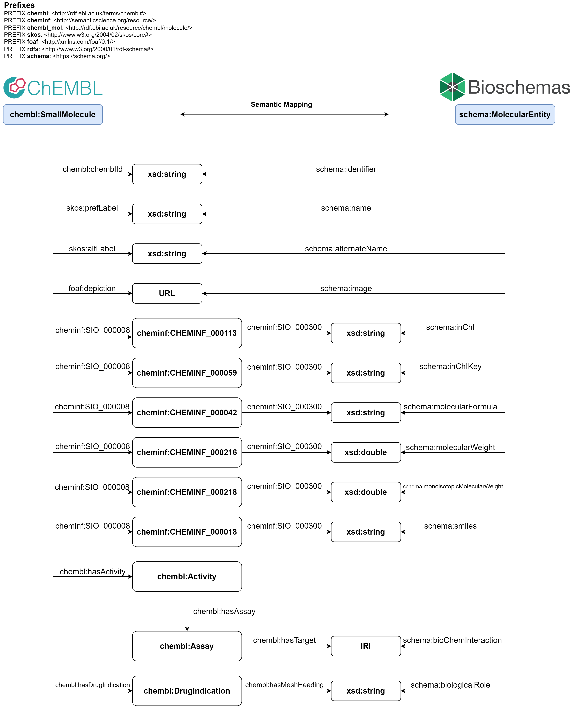
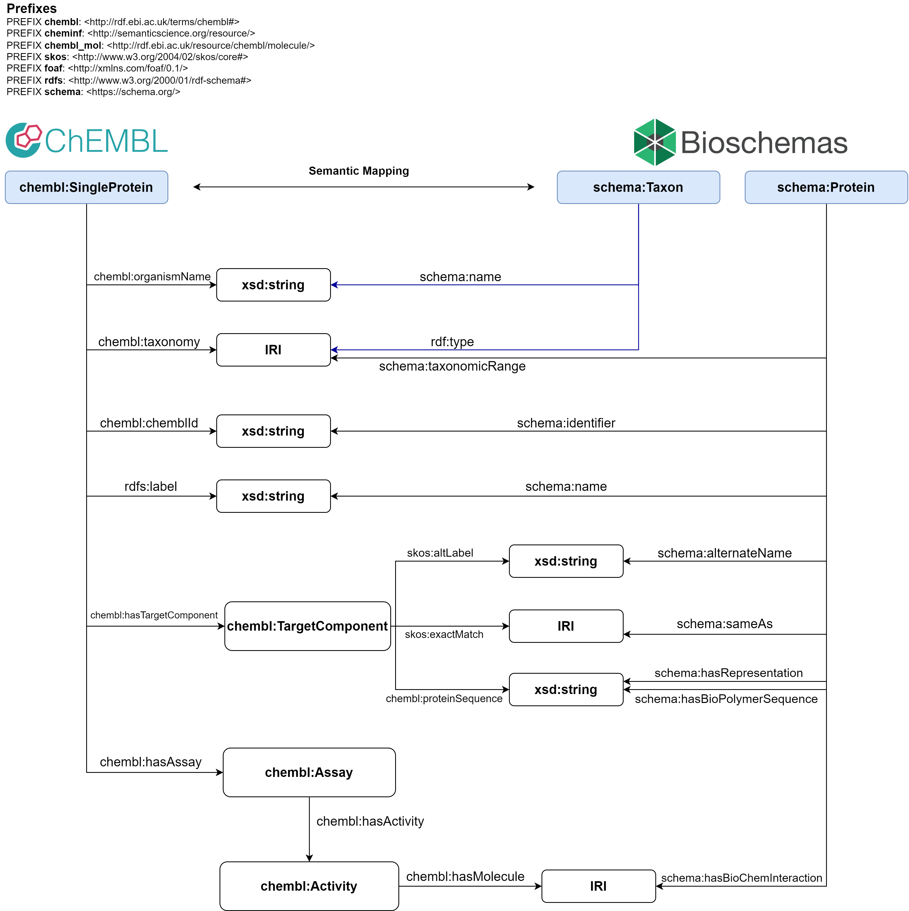
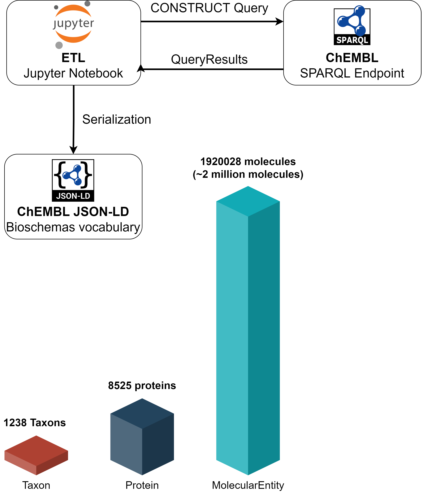

# SWAT4HCLS Hackathon Bioshcemas Project

During the hackathon of [SWAT4HCLS](http://www.swat4ls.org/) (Jan 10-13th 2022), I worked on a project aiming at providing the ChEMBL database in JSON-LD format according to the bioschemas.org vocabulary.

Researchers participated in this project: 
- Ammar Ammar (https://orcid.org/0000-0002-8399-8990)
- Alasdair Gray (https://orcid.org/0000-0003-1460-8327)
- François Belleau (https://orcid.org/0000-0002-9816-1093)

The project focused on mapping [ChEMBL](https://www.ebi.ac.uk/chembl/) data onto 3 types of entities from the Bioschemas vocbulary:

1. [MolecularEntity](https://bioschemas.org/MolecularEntity)
2. [Protein](https://bioschemas.org/Protein)
3. [Taxon](https://bioschemas.org/Taxon)

The approach adopted in this project is based on using the [ChEMBL mirror SPARQL endpoint (v28)](https://chemblmirror.rdf.bigcat-bioinformatics.org/) hosted by the department of Bioinforamtics at [Maastricht University](https://www.maastrichtuniversity.nl/) (BiGCaT) to construct the new RDF (following the [Bioschemas](https://bioschemas.org/) vocabulary) from the ChEMBL RDF. A mapping between the ChEMBL entities and predicates and the Bioschemas ones was performed using SPARQL queries according to the following figures.

 

### Mapping ChEMBL "SmallMolecule" to Bioschemas "MolecularEntity"

  

 
 

### Mapping ChEMBL "SingleProtein" to Bioschemas "Protein"

  

 
 

### Implementation

- The SPARQL queries used for the mapping are available in the "queries" folder.
- The mapping was implemented using Python, Jupyter Notebook and the SPARQLWrapper package. The notebook "ETL.ipynb" contains the code for mapping the ChEMBL RDF to Bioschemas and serializing the results into JSON-LD format. The construction of the molecular entities was performed in batches (100k molecules in each batch).  
- The process took **~4.5 hours** using a personal laptop (Core-i7 CPU & 16GB RAM)  
- Number of mapped molecules: **1920028  molecules (~2 million molecules)**
- Number of mapped proteins: **8525 proteins**
- Size of the output JSON-LD: **2.68 GB unzipped (380 MB zipped)**
- The following figure shows an overview of the implementation

 

  

 
 

## NOTE: you can dowload the JSON-LD resulted from this project from the releases tab
